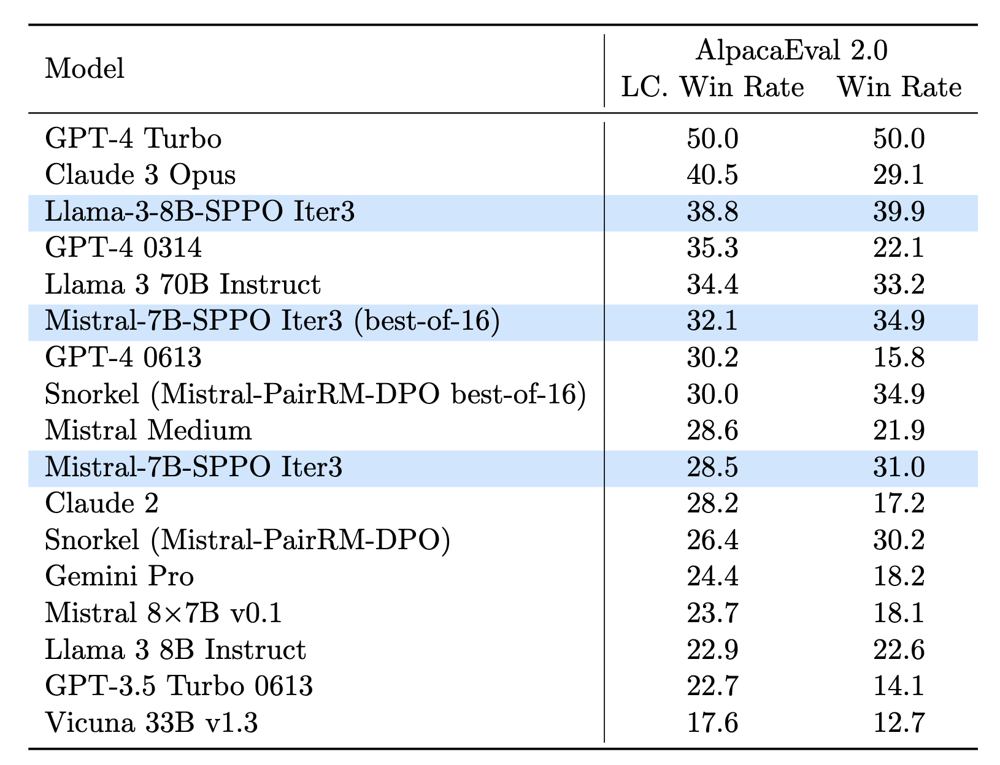

# SPPO: Self-Play Preference Optimization for Language Model Alignment (4bit quant implementation)

    

---

## About SPPO 4-bit quant

This repository is a fork of [uclaml/SPPO](https://github.com/uclaml/SPPO), this is my frustrating attempt to run this training method on 2 home GPUs (2x RTX 4090).
All code was adapted for use on 2 GPUs, from synthetic dataset generation to SPPO training. Feel free to contribute.

---


This repository contains the non-official code (4bit quant) and official released models for the paper [Self-Play Preference Optimization for Language Model Alignment](https://arxiv.org/abs/2405.00675).

Authors: [Yue Wu](https://yuewu.us/)\*, [Zhiqing Sun](https://www.cs.cmu.edu/~zhiqings/)\*, [Huizhuo Yuan](https://scholar.google.com/citations?user=8foZzX4AAAAJ)\*, [Kaixuan Ji](https://scholar.google.com/citations?user=FOoKDukAAAAJ), [Yiming Yang](https://www.cs.cmu.edu/~yiming/), [Quanquan Gu](https://web.cs.ucla.edu/~qgu/)

[[Webpage](https://uclaml.github.io/SPPO/)] [[Huggingface](https://huggingface.co/papers/2405.00675)] [[Paper](https://arxiv.org/abs/2405.00675)]


## About SPPO
We propose a new self-play framework dubbed SPPO for language model alignment and a new learning objective (called SPPO loss) derived from the self-play framework to fine-tune large language models efficiently.

<p align="center">
     <br>
  AlpacaEval 2.0 leaderboard results of normal and length-controlled (LC) win rates in percentage (\%). Mistral-7B-SPPO can outperform larger models and Mistral-7B-SPPO (best-of-16) can outperform proprietary models such as GPT-4(6/13). Llama-3-8B-SPPO exhibits even better performance.
</p>


SPPO can significantly enhance the performance of an LLM without strong external signals such as responses or preferences from GPT-4.  It can outperform the model trained with iterative direct preference optimization (DPO), among other methods. SPPO is theoretically grounded, ensuring that the LLM can converge to the von Neumann winner (i.e., Nash equilibrium) under general, potentially intransitive preference, and empirically validated through extensive evaluations on multiple datasets.

For more details, you can check our paper [here](https://arxiv.org/abs/2405.00675).


## Base Models and Released Models

| Model  | AlpacaEval2.0 LC Win Rate | AlpacaEval2.0 Win Rate |
| :--- | :---: | :---: |
|🤗[Mistral-7B-Instruct-v0.2](https://huggingface.co/mistralai/Mistral-7B-Instruct-v0.2)  | 17.11 | 14.72 |
|🤗[Mistral-7B-SPPO Iter1](https://huggingface.co/UCLA-AGI/Mistral7B-PairRM-SPPO-Iter1) |24.79 | 23.51|
|🤗[Mistral-7B-SPPO Iter2](https://huggingface.co/UCLA-AGI/Mistral7B-PairRM-SPPO-Iter2) |26.89 |27.62 |
|🤗[Mistral-7B-SPPO Iter3](https://huggingface.co/UCLA-AGI/Mistral7B-PairRM-SPPO-Iter3) |28.53 |31.02|
|🤗[Llama-3-8B-Instruct](https://huggingface.co/meta-llama/Meta-Llama-3-8B-Instruct) |22.92 |22.57 |
|🤗[Llama-3-8B-SPPO Iter1](https://huggingface.co/UCLA-AGI/Llama-3-Instruct-8B-SPPO-Iter1) |31.73 |31.74 |
|🤗[Llama-3-8B-SPPO Iter2](https://huggingface.co/UCLA-AGI/Llama-3-Instruct-8B-SPPO-Iter2) |35.15 |35.98 |
|🤗[Llama-3-8B-SPPO Iter3](https://huggingface.co/UCLA-AGI/Llama-3-Instruct-8B-SPPO-Iter3) |38.77 |39.85 |
|🤗[Gemma-2-9B-It](https://huggingface.co/google/gemma-2-9b-it) |45.08 |35.62 |
|🤗[Gemma-2-9B-SPPO Iter1](https://huggingface.co/UCLA-AGI/Gemma-2-9B-It-SPPO-Iter1) |48.70 |40.76 |
|🤗[Gemma-2-9B-SPPO Iter2](https://huggingface.co/UCLA-AGI/Gemma-2-9B-It-SPPO-Iter2) |50.93 | 44.64 |
|🤗[Gemma-2-9B-SPPO Iter3](https://huggingface.co/UCLA-AGI/Gemma-2-9B-It-SPPO-Iter3) |**53.27** |**47.74** |


## Environment Setup
Our training code is based on the alignment-handbook codebase. We utilize `vllm` for generation and `pairRM` for ranking. Follow the steps below to set up your environment:

1. **Create a Virtual Environment:**

   ```bash
   conda create -n sppo python=3.10
   conda activate sppo
   ```

2. **Install vllm for Generation:**
   ```bash
   pip install vllm
   ```

3. **Install PairRM:**
   ```bash
   git clone https://github.com/yuchenlin/LLM-Blender.git
   cd LLM-Blender
   pip install -e .
   ```

4. **Download and Install Training Dependencies:**
   ```bash
   git clone https://github.com/kaykyr/SPPO.git
   cd SPPO
   pip install -e .
   ```

## Training Scripts
Execute the training scripts based on the base model you choose:

- For **Llama-3**:
  ```bash
  bash run.sh
  ```

  Don't forget to replace the model path on run.sh, and some scripts in ./scripts

  Use `tail -f ./out/logs/*` to follow the logs details

These scripts manage the training iterations, generation, and PairRM ranking processes. Note that some scripts may attempt to push datasets to the Hugging Face Hub under the UCLA-AGI organization. Ensure you have write access, or modify the organization name accordingly, or comment out any `push_to_hub` commands if necessary. Detailed scripts for each component are listed as follows:

### Breakdown of Scripts:
1. **Generation:**
   ```bash
   python scripts/generate.py --model $MODEL --maxlen 2048 --output_dir $OUTPUT_DIR --prompts $PROMPTS
   ```

2. **Ranking:**
   ```bash
   python scripts/rank.py --output_dir $OUTPUT_DIR --prompts $PROMPTS
   ```
3. **Training:**
   ```bash
   bash scripts/pipeline.sh --model $MODEL --iter $ITER --dataset $DATASET --output_dir $OUTPUT_DIR --num 1
   ```

## Evaluation
We adhere to the established guidelines for evaluation and utilize the following repositories:
- [AlpacaEval 2](https://github.com/tatsu-lab/alpaca_eval)
- [MT-Bench](https://github.com/lm-sys/FastChat/tree/main/fastchat/llm_judge)
- [HuggingFace Open LLM Leaderboard](https://huggingface.co/spaces/open-llm-leaderboard/open_llm_leaderboard)

We provide the model configurations used during AlpacaEval 2 in the `models_configs` directory. Please note that after the initial release of our model, we retrained it using a slightly modified prompt. The win rates observed post-retraining are comparable to the original results.


## Troubleshoot
For questions related to the paper, please contact the authors via email. If you encounter any issues with the code or wish to report a bug, feel free to open an issue on our GitHub repository.

## Citation

```
@article{wu2024self,
  title={Self-play preference optimization for language model alignment},
  author={Wu, Yue and Sun, Zhiqing and Yuan, Huizhuo and Ji, Kaixuan and Yang, Yiming and Gu, Quanquan},
  year={2024}
}
```

## Acknowledgements

We thank the authors of [The Alignment Handbook](https://github.com/huggingface/alignment-handbook) for their foundational contributions to the training code. We also acknowledge the use of [PairRM](https://github.com/yuchenlin/LLM-Blender) for ranking and [vllm](https://github.com/vllm-project/vllm) for generation.

## TODO - Quant version
- [ ] Fix generation (it's working but is duplicating data, we can fix it later)
- [ ] Traning code (it's almost done, when ready, we can clean the code and implements a easy-to-use script)
- [ ] Write documentation
